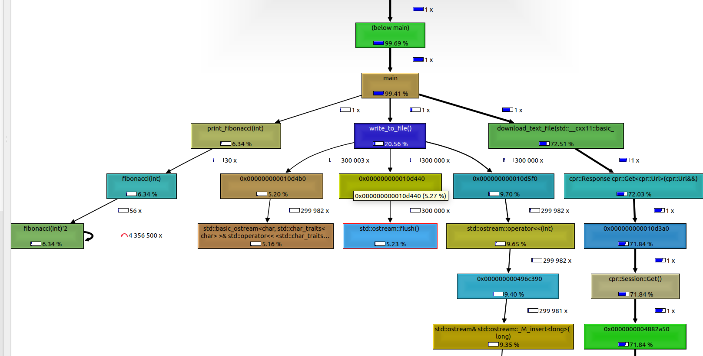

# First Homework Report

## Monitoring and profiling tools used


### strace

Trace system calls and signals.

#### Command line

```bash
strace -c ./program_for_profiling
```

#### The most time consuming system calls

```bash
% time     seconds  usecs/call     calls    errors syscall
------ ----------- ----------- --------- --------- ----------------
 80,18    1,764837           5    300017           write
  7,01    0,154378           2     61690           rt_sigaction
  6,86    0,150889           3     42113      1002 read
  5,73    0,126180           3     41115           poll
  0,15    0,003274         327        10           munmap
  0,02    0,000472           8        57        42 openat
  0,02    0,000372          13        27           close
  0,01    0,000273           5        54           mmap
  0,01    0,000149           3        45        27 newfstatat
  0,00    0,000068           4        14           mprotect
  0,00    0,000033           1        23           futex
  0,00    0,000012           0        38           brk
  0,00    0,000011           2         4           pread64
  0,00    0,000005           5         1         1 access
  0,00    0,000005           5         1           clock_nanosleep
  0,00    0,000004           2         2         1 arch_prctl
  0,00    0,000004           2         2           getrandom
  0,00    0,000003           3         1           set_robust_list
  0,00    0,000003           3         1           prlimit64
  0,00    0,000003           3         1           rseq
  0,00    0,000002           2         1           set_tid_address
  0,00    0,000000           0         1           lseek
  0,00    0,000000           0         5           rt_sigprocmask
  0,00    0,000000           0        23           getpid
  0,00    0,000000           0         9           socket
  0,00    0,000000           0         5         2 connect
  0,00    0,000000           0         3           accept
  0,00    0,000000           0         3           bind
  0,00    0,000000           0         3           listen
  0,00    0,000000           0         8           getsockname
  0,00    0,000000           0         5           getpeername
  0,00    0,000000           0        13           setsockopt
  0,00    0,000000           0         2           getsockopt
  0,00    0,000000           0         1           execve
  0,00    0,000000           0        14           fcntl
  0,00    0,000000           0         1           sysinfo
  0,00    0,000000           0         2           clone3
------ ----------- ----------- --------- --------- ----------------
100,00    2,200977           4    445315      1075 total

```

We can see that "write" system call consumes the most time of our program. Looking at this results we can suspect that program uses non-optimal writing strategies.

### valgrind


### Command line

```bash
 valgrind --tool=callgrind ./program_for_profiling
 callgrind_annotate callgrind.out.41112
```

### Output
```bash
  4,848,200 ( 0.38%)  ???:0x00000000001b6500 [/usr/lib/x86_64-linux-gnu/libcrypto.so.3]
  4,823,280 ( 0.38%)  ???:OSSL_DECODER_is_a [/usr/lib/x86_64-linux-gnu/libcrypto.so.3]
  4,800,080 ( 0.38%)  /home/roman/Projects/PerformanceEngineering/FirstHomework/program_for_profiling.cpp:write_to_file() [/home/roman/Projects/PerformanceEngineering/FirstHomework/build/program_for_profiling]
  4,515,501 ( 0.36%)  ???:CRYPTO_malloc [/usr/lib/x86_64-linux-gnu/libcrypto.so.3]
  4,437,329 ( 0.35%)  ./string/../sysdeps/x86_64/multiarch/strcmp-avx2.S:__strcmp_avx2 [/usr/lib/x86_64-linux-gnu/libc.so.6]
  4,200,000 ( 0.33%)  ???:std::basic_filebuf<char, std::char_traits<char> >::sync() [/usr/lib/x86_64-linux-gnu/libstdc++.so.6.0.30]
  3,844,786 ( 0.30%)  ???:0x000000000018bc20 [/usr/lib/x86_64-linux-gnu/libcrypto.so.3]
  3,831,686 ( 0.30%)  ???:0x00000000001e6d20 [/usr/lib/x86_64-linux-gnu/libcrypto.so.3]
  3,300,341 ( 0.26%)  ???:std::ostream::operator<<(int) [/usr/lib/x86_64-linux-gnu/libstdc++.so.6.0.30]
  3,011,154 ( 0.24%)  ???:OSSL_DECODER_CTX_add_extra [/usr/lib/x86_64-linux-gnu/libcrypto.so.3]
  2,975,439 ( 0.23%)  ./string/../sysdeps/x86_64/multiarch/memset-vec-unaligned-erms.S:__memset_avx2_unaligned_erms [/usr/lib/x86_64-linux-gnu/libc.so.6]
  2,836,024 ( 0.22%)  ???:0x00000000000ce650'2 [/usr/lib/x86_64-linux-gnu/libcrypto.so.3]
  2,830,581 ( 0.22%)  ./stdlib/./stdlib/msort.c:msort_with_tmp.part.0'2 [/usr/lib/x86_64-linux-gnu/libc.so.6]

```
Here we can again see that  `write_to_file` function take a lot of clock time.

### KCachegrind
```
kcachegrind callgrind.out.41909 
```

### Output


With the help of `kcachegrind` we can see calls graph and how much time function took with respect to the total time of program execution.  
Here we can also notice that `fibonnaci` function was called more than 4 million times and it may indicate that algorithm is not optimal.
The same thing with the `flash` call inside `write_to_file` function.

### netstat

Network monitoring tool.

#### Command line

```bash
netstat -ep -t 20 -c | grep "program_for_profiling"
```

#### Output

```bash
(Not all processes could be identified, non-owned process info
 will not be shown, you would have to be root to see it all.)
(Not all processes could be identified, non-owned process info
 will not be shown, you would have to be root to see it all.)
(Not all processes could be identified, non-owned process info
 will not be shown, you would have to be root to see it all.)
(Not all processes could be identified, non-owned process info
 will not be shown, you would have to be root to see it all.)
(Not all processes could be identified, non-owned process info
 will not be shown, you would have to be root to see it all.)
(Not all processes could be identified, non-owned process info
 will not be shown, you would have to be root to see it all.)
(Not all processes could be identified, non-owned process info
 will not be shown, you would have to be root to see it all.)
```

Here we can see the connection from the binary. For some reason it shows that there are no connections associated with the binary.

## Conclusion

- `strace` - writing to file could be optimized by writing chucks of bytes
- `netstat` - shows high network usage in binary but does not give information about specific function
- `valgrind` - perform very detailed profiling to help find bottlenecks in your programs
- `kcachegrind` - visualize the results of `valgrind` command as a graph of function calls, helps to detect bottlenecks